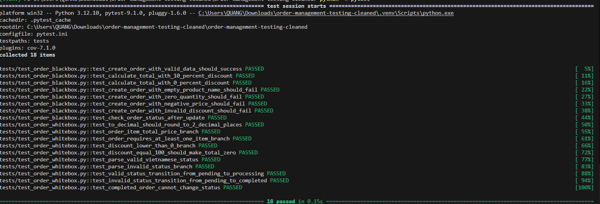
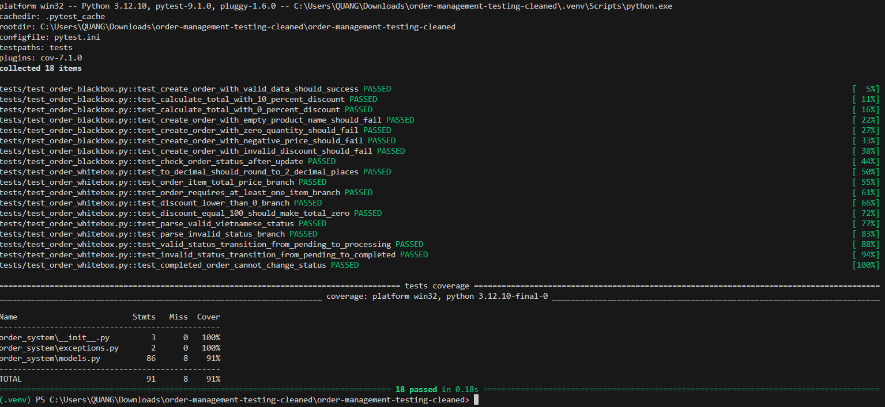

# Order Management System Testing

## Báo cáo thực hành kiểm thử hệ thống quản lý đơn hàng đơn giản

**Sinh viên thực hiện:** Đặng Minh Quang
**Mã sinh viên:** 23010030
**Lớp:** KTPM_EL1
**Môn học:** Đánh giá và kiểm định chất lượng phần mềm

---

## 1. Giới thiệu

Dự án **Order Management System Testing** được xây dựng nhằm phục vụ bài báo cáo kiểm thử và đánh giá chất lượng phần mềm với đề tài:

**"Kiểm thử và đánh giá chất lượng hệ thống quản lý đơn hàng đơn giản"**

Hệ thống được xây dựng bằng ngôn ngữ Python, tập trung vào các chức năng xử lý nghiệp vụ cơ bản của một hệ thống quản lý đơn hàng như tạo đơn hàng, tính tổng tiền, áp dụng giảm giá và cập nhật trạng thái đơn hàng.

Bên cạnh việc xây dựng chương trình, dự án còn thực hiện kiểm thử tự động bằng công cụ `pytest`, kết hợp kiểm thử hộp đen và kiểm thử hộp trắng để đánh giá tính đúng đắn của hệ thống.

---

## 2. Mục tiêu dự án

Mục tiêu của dự án là xây dựng một hệ thống quản lý đơn hàng đơn giản và thực hiện kiểm thử các chức năng chính của hệ thống.

Các mục tiêu cụ thể gồm:

* Xây dựng chức năng tạo đơn hàng.
* Kiểm tra dữ liệu đầu vào của sản phẩm.
* Tính tổng tiền đơn hàng.
* Áp dụng phần trăm giảm giá.
* Kiểm tra và cập nhật trạng thái đơn hàng.
* Viết test case kiểm thử hộp đen.
* Viết test case kiểm thử hộp trắng.
* Chạy kiểm thử tự động bằng `pytest`.
* Đo độ bao phủ mã nguồn bằng `pytest-cov`.
* Đánh giá kết quả kiểm thử và đưa ra kết luận.

---

## 3. Chức năng của hệ thống

Hệ thống quản lý đơn hàng đơn giản gồm các chức năng chính sau:

| STT | Chức năng                    | Mô tả                                                    |
| --- | ---------------------------- | -------------------------------------------------------- |
| 1   | Tạo đơn hàng                 | Cho phép tạo đơn hàng gồm một hoặc nhiều sản phẩm        |
| 2   | Kiểm tra dữ liệu sản phẩm    | Kiểm tra tên sản phẩm, số lượng và đơn giá               |
| 3   | Tính tổng tiền               | Tính tổng tiền của đơn hàng dựa trên số lượng và đơn giá |
| 4   | Áp dụng giảm giá             | Áp dụng phần trăm giảm giá hợp lệ từ 0% đến 100%         |
| 5   | Kiểm tra trạng thái đơn hàng | Hiển thị trạng thái hiện tại của đơn hàng                |
| 6   | Cập nhật trạng thái đơn hàng | Chuyển trạng thái đơn hàng theo đúng quy trình hợp lệ    |

---

## 4. Công cụ sử dụng

| Công cụ            | Mục đích                                 |
| ------------------ | ---------------------------------------- |
| Python             | Xây dựng hệ thống quản lý đơn hàng       |
| pytest             | Viết và chạy kiểm thử tự động            |
| pytest-cov         | Đo độ bao phủ mã nguồn                   |
| Visual Studio Code | Viết code và chạy chương trình           |
| GitHub             | Lưu trữ source code và báo cáo README.md |

---

## 5. Cấu trúc thư mục

```text
order-management-testing/
├── order_system/
│   ├── __init__.py
│   ├── exceptions.py
│   └── models.py
├── tests/
│   ├── test_order_blackbox.py
│   └── test_order_whitebox.py
├── docs/
│   └── test_cases.md
├── main.py
├── pytest.ini
├── requirements.txt
├── .gitignore
└── README.md
```

Ý nghĩa các thư mục và file chính:

| Thành phần         | Mô tả                                |
| ------------------ | ------------------------------------ |
| order_system/      | Chứa mã nguồn chính của hệ thống     |
| tests/             | Chứa các file kiểm thử bằng pytest   |
| docs/test_cases.md | Tài liệu mô tả test case             |
| main.py            | File chạy chương trình mẫu           |
| pytest.ini         | Cấu hình pytest                      |
| requirements.txt   | Danh sách thư viện cần cài đặt       |
| README.md          | Báo cáo và hướng dẫn sử dụng project |

---

## 6. Cài đặt môi trường

### 6.1. Tạo môi trường ảo

```bash
python -m venv .venv
```

### 6.2. Kích hoạt môi trường ảo trên Windows

```bash
.venv\Scripts\activate
```

Hoặc sử dụng PowerShell:

```bash
.\.venv\Scripts\Activate.ps1
```

### 6.3. Cài đặt thư viện

```bash
python -m pip install -r requirements.txt
```

---

## 7. Chạy chương trình mẫu

Để chạy chương trình mẫu, sử dụng lệnh:

```bash
python main.py
```

Chương trình sẽ tạo đơn hàng mẫu, tính tổng tiền, áp dụng giảm giá và hiển thị trạng thái đơn hàng.

---

## 8. Chạy kiểm thử

### 8.1. Chạy toàn bộ test case

```bash
python -m pytest
```

### 8.2. Chạy kiểm thử kèm báo cáo coverage

```bash
python -m pytest --cov=order_system
```

---

## 9. Nội dung kiểm thử

Dự án thực hiện hai kỹ thuật kiểm thử chính:

* Kiểm thử hộp đen
* Kiểm thử hộp trắng

---

## 10. Kiểm thử hộp đen

Kiểm thử hộp đen tập trung vào đầu vào và đầu ra của hệ thống, không xét đến cách cài đặt bên trong mã nguồn.

Các chức năng được kiểm thử hộp đen gồm:

* Tạo đơn hàng với dữ liệu hợp lệ.
* Tạo đơn hàng với tên sản phẩm rỗng.
* Tạo đơn hàng với số lượng không hợp lệ.
* Tạo đơn hàng với đơn giá không hợp lệ.
* Tính tổng tiền đơn hàng.
* Áp dụng giảm giá hợp lệ.
* Áp dụng giảm giá không hợp lệ.
* Cập nhật trạng thái đơn hàng hợp lệ và không hợp lệ.

Một số test case hộp đen tiêu biểu:

| TC   | Dữ liệu kiểm thử                 | Kết quả mong đợi                           |
| ---- | -------------------------------- | ------------------------------------------ |
| BB01 | Tạo đơn hàng với sản phẩm hợp lệ | Đơn hàng được tạo thành công               |
| BB02 | Tên sản phẩm rỗng                | Hệ thống báo lỗi tên sản phẩm không hợp lệ |
| BB03 | Số lượng bằng 0 hoặc âm          | Hệ thống báo lỗi số lượng không hợp lệ     |
| BB04 | Đơn giá bằng 0 hoặc âm           | Hệ thống báo lỗi đơn giá không hợp lệ      |
| BB05 | Áp dụng giảm giá 10%             | Tổng tiền sau giảm giá được tính đúng      |
| BB06 | Áp dụng giảm giá 120%            | Hệ thống báo lỗi giảm giá không hợp lệ     |
| BB07 | Chuyển trạng thái hợp lệ         | Trạng thái được cập nhật thành công        |
| BB08 | Chuyển trạng thái không hợp lệ   | Hệ thống báo lỗi chuyển trạng thái         |

---

## 11. Kiểm thử hộp trắng

Kiểm thử hộp trắng tập trung vào logic xử lý bên trong mã nguồn, bao gồm các nhánh điều kiện, ngoại lệ và quy tắc nghiệp vụ.

Các nội dung được kiểm thử hộp trắng gồm:

* Kiểm tra hàm làm tròn số tiền.
* Kiểm tra tính tổng tiền từng sản phẩm.
* Kiểm tra đơn hàng rỗng.
* Kiểm tra điều kiện giảm giá nhỏ hơn 0.
* Kiểm tra giá trị biên giảm giá bằng 100%.
* Kiểm tra trạng thái hợp lệ và không hợp lệ.
* Kiểm tra chuyển trạng thái hợp lệ.
* Kiểm tra chuyển trạng thái không hợp lệ.
* Kiểm tra trạng thái cuối không được chuyển tiếp.

Một số test case hộp trắng tiêu biểu:

| TC   | Tên test                                                 | Mục tiêu                                        |
| ---- | -------------------------------------------------------- | ----------------------------------------------- |
| WB01 | test_to_decimal_should_round_to_2_decimal_places         | Kiểm tra làm tròn Decimal                       |
| WB02 | test_order_item_total_price_branch                       | Kiểm tra tính tiền từng sản phẩm                |
| WB03 | test_order_requires_at_least_one_item_branch             | Kiểm tra đơn hàng rỗng                          |
| WB04 | test_discount_lower_than_0_branch                        | Kiểm tra giảm giá nhỏ hơn 0                     |
| WB05 | test_discount_equal_100_should_make_total_zero           | Kiểm tra giảm giá bằng 100%                     |
| WB06 | test_parse_valid_vietnamese_status                       | Kiểm tra parse trạng thái hợp lệ                |
| WB07 | test_parse_invalid_status_branch                         | Kiểm tra trạng thái không hợp lệ                |
| WB08 | test_valid_status_transition_from_pending_to_processing  | Kiểm tra chuyển trạng thái hợp lệ               |
| WB09 | test_invalid_status_transition_from_pending_to_completed | Kiểm tra chuyển trạng thái không hợp lệ         |
| WB10 | test_completed_order_cannot_change_status                | Kiểm tra trạng thái cuối không được chuyển tiếp |

---

## 12. Quy tắc trạng thái đơn hàng

Hệ thống quản lý trạng thái đơn hàng theo quy trình sau:

| Trạng thái hiện tại | Trạng thái tiếp theo hợp lệ |
| ------------------- | --------------------------- |
| Chờ xử lý           | Đang xử lý, Đã hủy          |
| Đang xử lý          | Đang giao, Đã hủy           |
| Đang giao           | Hoàn thành                  |
| Hoàn thành          | Không được chuyển tiếp      |
| Đã hủy              | Không được chuyển tiếp      |

Các bước chuyển trạng thái không thuộc bảng trên sẽ bị hệ thống từ chối và phát sinh lỗi.

---

## 13. Kết quả kiểm thử

Sau khi chạy toàn bộ test case bằng pytest, kết quả kiểm thử như sau:

| Nội dung            | Kết quả    |
| ------------------- | ---------- |
| Tổng số test case   | 18         |
| Số test case Pass   | 18         |
| Số test case Fail   | 0          |
| Tỷ lệ Pass          | 100%       |
| Công cụ kiểm thử    | pytest     |
| Công cụ đo coverage | pytest-cov |
| Độ bao phủ mã nguồn | Khoảng 91% |

Kết quả cho thấy toàn bộ test case đều chạy thành công và không có test case nào bị lỗi.

---

## 14. Hình ảnh minh họa kết quả thực hiện

### 14.1. Kết quả chạy pytest

Ảnh dưới đây minh họa kết quả chạy toàn bộ test case bằng lệnh `python -m pytest`.



### 14.2. Kết quả đo độ bao phủ mã nguồn

Ảnh dưới đây minh họa kết quả chạy kiểm thử kèm đo coverage bằng lệnh `python -m pytest --cov=order_system`.



---

## 15. Phân tích kết quả kiểm thử

Kết quả kiểm thử cho thấy hệ thống đã đáp ứng các yêu cầu kiểm thử cơ bản. Toàn bộ 18 test case đều Pass, chứng tỏ các chức năng chính như tạo đơn hàng, tính tổng tiền, áp dụng giảm giá và cập nhật trạng thái đơn hàng hoạt động đúng theo đặc tả.

Các trường hợp dữ liệu không hợp lệ như tên sản phẩm rỗng, số lượng nhỏ hơn hoặc bằng 0, đơn giá không hợp lệ, giảm giá ngoài khoảng cho phép đều được hệ thống phát hiện và xử lý bằng ngoại lệ phù hợp.

Việc kiểm thử hộp đen giúp đánh giá hệ thống theo góc nhìn đầu vào và đầu ra, trong khi kiểm thử hộp trắng giúp kiểm tra kỹ hơn các nhánh logic bên trong mã nguồn. Sự kết hợp giữa hai kỹ thuật này giúp tăng độ tin cậy của kết quả kiểm thử.

Bên cạnh đó, việc sử dụng `pytest-cov` giúp đánh giá mức độ bao phủ mã nguồn. Độ bao phủ đạt khoảng 91%, cho thấy phần lớn mã nguồn chính đã được thực thi trong quá trình kiểm thử.

---

## 16. Nhận xét

Thông qua dự án này, em đã hiểu rõ hơn về quy trình kiểm thử phần mềm bằng công cụ pytest. Em đã biết cách tổ chức source code, viết test case, chạy kiểm thử tự động và phân tích kết quả kiểm thử.

Bài thực hành cũng giúp em phân biệt rõ hơn giữa kiểm thử hộp đen và kiểm thử hộp trắng. Kiểm thử hộp đen tập trung vào dữ liệu đầu vào và kết quả đầu ra, trong khi kiểm thử hộp trắng tập trung vào logic xử lý bên trong chương trình.

Việc đưa mã nguồn lên GitHub và viết báo cáo trong README.md giúp quá trình nộp bài rõ ràng, dễ kiểm tra và dễ tái sử dụng.

---

## 17. Kết luận

Dự án **Order Management System Testing** đã xây dựng được một hệ thống quản lý đơn hàng đơn giản và thực hiện kiểm thử tự động bằng pytest.

Các chức năng chính của hệ thống đều được kiểm thử với cả trường hợp hợp lệ và không hợp lệ. Kết quả kiểm thử cho thấy hệ thống hoạt động ổn định, các quy tắc nghiệp vụ được xử lý đúng và các lỗi đầu vào được phát hiện phù hợp.

Trong tương lai, hệ thống có thể được mở rộng thêm các chức năng như lưu trữ dữ liệu vào cơ sở dữ liệu, phát triển giao diện web, xây dựng API và kiểm thử API bằng Postman.

---

## 18. Link GitHub

Source code project:

```text
https://github.com/23010030-Quang/Order-Management-System-Testing
```

---

## 19. Tài liệu tham khảo

* Tài liệu pytest.
* Tài liệu pytest-cov.
* Giáo trình và tài liệu môn Đánh giá và kiểm định chất lượng phần mềm.
